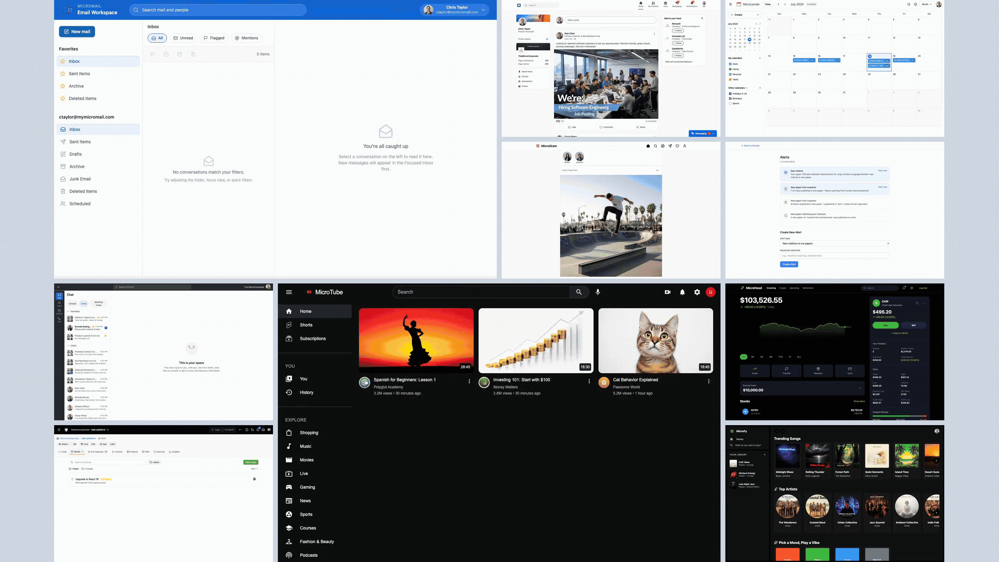

<div align="center">


*A benchmark for evaluating AI agents on long-horizon monitoring tasks.*

<!-- TODO: replace placeholder arXiv and blog URLs before public release -->
<a href="https://microhood.ai"></a> <a href="https://x.com/microhood_ai"></a> <a href="https://arxiv.org/abs/2606.05342"></a> <a href="https://www.microsoft.com/en-us/research/articles/sentinelbench-a-benchmark-for-long-running-monitoring-agents/"></a> <a href="LICENSE"></a>



</div>

---

**Sentinel Environments** is a benchmark of 10 high-fidelity web-app replicas that tests whether an agent can *wait*, *monitor*, and *act* only when a condition is met. Each environment replays a scripted timeline of events; the agent must notice the right moment and respond, without wasting resources polling in between.

Project site: [microhood.ai](https://microhood.ai) · X: [@microhood_ai](https://x.com/microhood_ai)

This README covers **how to run the benchmark**. For the motivation, task design, and baseline results, see the [paper](https://arxiv.org/abs/2606.05342) and [blog post](https://www.microsoft.com/en-us/research/articles/sentinelbench-a-benchmark-for-long-running-monitoring-agents/).

## Environments

The benchmark ships 10 environments (`Micro*`), each with 10 monitoring scenarios (100 total).

| Environment | Mimics | Surface | Data Type |
|-------------|--------|---------|-----------|
| MicroMail | Email (Gmail/Outlook) | Inbox, folders, attachments, search | Synthetic images |
| MicroChat | Team messaging (Slack/Teams) | Teams, channels, DMs, calls | Synthetic images |
| MicroDin | Professional network (LinkedIn) | Feed, connections, jobs, messaging | Synthetic images |
| MicroHub | Code hosting (GitHub) | Repo, issues, PRs, commits, releases | Text-only (JSONL) |
| MicroHood | Stock trading (Robinhood) | Portfolio, orders, watchlist, news | Text-only (JSONL) |
| MicroGram | Photo sharing (Instagram) | Feed, stories, DMs, activity | Synthetic images |
| MicroTube | Video platform (YouTube) | Feed, player, comments, subscriptions | Synthetic video/images |
| MicroFy | Music streaming (Spotify) | Tracks, playlists, artists, lyrics | Synthetic audio |
| MicroLendar | Calendar (Google Calendar) | Month/week/day views, events, tasks | Text-only (JSONL) |
| MicroScholar | Academic search (Google Scholar) | Search, papers, authors, alerts | Text-only (JSONL) |

> Environments marked **Text-only (JSONL)** use structured text data with no AI-generated media. The others use AI-generated images, video, or audio produced by the pipeline in [`data_generation/`](#regenerating-synthetic-media).

### Robinhood Chain / MSFT case

The MicroHood environment is the benchmark's deterministic stock-trading
replica. The repository also includes a read-only Robinhood Chain boundary that
uses the official `MSFT` Stock Token as its concrete asset case. See
[`ROBINHOOD_CHAIN_MSFT_CASE.md`](ROBINHOOD_CHAIN_MSFT_CASE.md) for the verified
mainnet deployment, validation flow, and the distinction between the official
MSFT asset and the separately displayed project CA.

## Quick Start

Set up local dependencies, build the SQLite databases, and run all three
components (API server, frontend, harness shell) in one tmux session:

```bash
./start.sh
```

On the first run, this creates `.venv`, installs Python and Node dependencies,
and builds the gitignored `.db` files. It then opens windows for the **server**
(API on `:8000`), the **frontend** (Vite on `:5173`), and a **harness** shell
ready for eval runs. To set things up manually instead, follow the three steps
below.

### 1. API server

```bash
python3 -m venv .venv
source .venv/bin/activate
pip install -r server/requirements.txt

# Build the SQLite databases from the JSONL catalogs (required on first setup,
# and whenever data/catalogs/ changes). The .db files are gitignored.
python -m server.scripts.build_db

uvicorn server.server:app --host 0.0.0.0 --port 8000
```

### 2. Frontend

```bash
cd frontend
npm ci
npm run dev
```

Open `http://localhost:5173` to use the environments by hand. The frontend proxies API calls to `localhost:8000`, so the API server must be running.

### 3. Eval harness

The harness discovers every scenario JSON, runs each one against your agent as a subprocess, and collects results. Configure your agent in an `eval_config.yaml` at the repo root:

```yaml
server_url: http://localhost:8000
frontend_url: http://localhost:5173

# Wall-clock vs sim-clock exchange rate. 1.0 = real-time (default),
# >1 is faster, <1 is slower. See "Runtime tuning" below.
speed_factor: 1.0

# Command to launch your agent. Placeholders are substituted per task:
#   __TASK_URL__    - task start URL (a GET starts the simulation + redirects)
#   __TASK_PROMPT__ - the task's natural-language prompt
# Use a list for direct execution, or a string for shell execution.
agent_subprocess: ["your-agent-command", "--url", "__TASK_URL__", "--prompt", "__TASK_PROMPT__"]
```

Run all scenarios, then grade:

```bash
# Execute scenarios (resumable: tasks with an existing result are skipped)
python -m server.eval_harness run my_first_run --config eval_config.yaml

# Optional: override the API URL from the config file
python -m server.eval_harness run my_first_run --config eval_config.yaml --server-url http://localhost:8000

# Summarize a completed run as a per-task table + aggregate stats
python -m server.eval_harness grade my_first_run
```

For a first smoke test, run a single scenario with `--task`:

```bash
python -m server.eval_harness run micromail_smoke \
  --config eval_config.yaml \
  --task micromail-unread-absolute-passive

python -m server.eval_harness grade micromail_smoke \
  --task micromail-unread-absolute-passive
```

To list available task IDs:

```bash
find scenarios -maxdepth 2 -name '*.json' ! -name dev.json -printf '%f\n' | sed 's/.json$//'
```

Results are written to `results/<run_name>/<environment>/<scenario_id>/`:

| File | Description |
|------|-------------|
| `results.json` | Evaluation result (`success`, `detail`, `evaluation_time`, `condition_at`, `contact_get_time`) |
| `output.txt` | Agent subprocess stdout/stderr |
| `error.txt` | Harness error traceback (only if the task failed to run) |

```text
$ python -m server.eval_harness run my_first_run
Found 100 tasks. Results -> results/my_first_run
  Running micromail-attachment-name-absolute-active ...
  Running micromail-body-december-relative-active ...
  ...
Done.
```

### Dev mode

Set `SENTINEL_DEV` to skip the `/init` flow and preload an environment with all of its catalog data, so the UI is populated without running the harness:

```bash
# Preload every environment
SENTINEL_DEV=all uvicorn server.server:app --reload --port 8000

# Preload a single environment
SENTINEL_DEV=microfy uvicorn server.server:app --reload --port 8000
```

Each environment ships a `scenarios/<env>/dev.json` that loads all catalog rows via `["*"]` wildcards. The eval harness always skips `dev.json`.

### Runtime tuning

`speed_factor` controls how fast the simulation clock advances relative to wall-clock. It is a top-level key in `eval_config.yaml` (and `--speed` on `run_simulation` for local playback) — never stored in scenario JSON. The harness sizes each task's subprocess timeout as `kill_at_wall = MAX_CONDITION_AT / speed_factor + REACTION_WINDOW`. `speed_factor > 1` compresses the timeline; `speed_factor < 1` stretches it.

| speed_factor | Effect | kill_at_wall (subprocess timeout) |
|--------------|--------|-----------------------------------|
| `4.0` (max) | 4× faster than real-time | 180s (3 min) |
| `2.0` | 2× faster than real-time | 330s (5.5 min) |
| `1.0` (default) | real-time | 630s (10.5 min) |
| `0.5` | 2× slower than real-time | 1230s (20.5 min) |
| `0.25` | 4× slower than real-time | 2430s (40.5 min) |

The 30-second reaction window past `condition_at` stays constant in wall-clock across all speeds; only the pre-target portion scales. `MAX_SPEED_FACTOR = 4.0` is enforced; the lower bound is only `speed_factor > 0`. All constants live in `server/timing.py`.

## How a scenario works

Each scenario is a JSON file under `scenarios/<env>/`, named `<target>-<criteria>-<activity>.json` (no-op scenarios use `<target>-<criteria>-noop.json`):

```json
{
  "id": "micromail-junk-relative-passive",
  "environment": "micromail",
  "prompt": "Keep an eye on the junk folder for me, tell me when 3 more emails end up there.",
  "condition_at": 297.75,
  "kill_at": 630.0,
  "event_timeline_end": 720.0,
  "events": [ { "time": 0, "type": "preload_emails", "payload": { } } ],
  "eval_sql": "SELECT (SELECT COUNT(*) FROM email_states WHERE folder='junk') >= (SELECT CAST(value AS INTEGER) FROM session_meta WHERE key='baseline_junk_count') + 3"
}
```

Timing fields, all in simulation-seconds:

- **`condition_at`** — earliest sim-time the success condition can become true. Randomized per scenario in `[10, 600]`, deterministic from `scenario_id`. For no-op scenarios it is `null` (the condition never fires). The released values are frozen; do not hand-edit them.
- **`kill_at`** — sim-time the harness terminates the run (`630`, constant).
- **`event_timeline_end`** — right edge of the authored timeline (`720`, constant).

Invariant (enforced by `tests/test_scenario_schema.py`): `0 < condition_at <= kill_at <= event_timeline_end` for normal scenarios, or `condition_at = null` for no-ops.

**Success.** After the agent finishes, the harness calls `POST /evaluate`, which materializes session state into an in-memory SQLite database and runs the scenario's `eval_sql`. A run passes when **both**: (1) `eval_sql` returns truthy, and (2) the agent hit the `/contact` endpoint at or after `condition_at`. No-op scenarios invert rule (2): success requires *never* visiting `/contact`.

## System requirements

- **OS**: Linux (Ubuntu 20.04+), macOS, or Windows WSL2
- **Python**: 3.11+
- **Node.js**: 18+
- **API keys**: none for the harness itself — only your agent (via `agent_subprocess`) needs provider keys, depending on the model you evaluate.

## Repository structure

```
sentinel_environments/
├── server/                # FastAPI backend
│   ├── handlers/          # Per-environment request handlers
│   ├── scripts/           # build_db.py (JSONL/JSON -> SQLite)
│   ├── server.py          # Main FastAPI app
│   ├── eval_harness.py    # CLI evaluation harness (discovers scenarios/)
│   ├── run_simulation.py  # Scenario playback tool for local testing
│   └── timing.py          # speed_factor / kill_at constants
├── scenarios/             # Scenario JSON per environment
│   └── <env>/             # <target>-<criteria>-<activity>.json + dev.json
├── data/catalogs/         # Immutable catalogs (users.json, per-env JSONL)
├── data/public/           # Static media served to the frontend
├── frontend/              # React + Vite + TypeScript frontend
├── data_generation/       # Synthetic-media pipeline (scripts, prompts, docs)
└── tests/                 # pytest suites (schema, eval_sql, integration, ...)
```

## Regenerating synthetic media

The catalogs and media ship with the repo, so you do **not** need to regenerate anything to run the benchmark. To reproduce the synthetic assets, see [`data_generation/docs/REPRODUCTION.md`](data_generation/docs/REPRODUCTION.md). Generation needs a CUDA GPU (NVIDIA A100 for images, B200 for video/audio) and a HuggingFace account for gated model access (FLUX.2-dev).

## License

This project is licensed under the [MIT License](LICENSE).

## Citation

<!-- TODO: replace with the published citation on release -->
```bibtex
@misc{maldaner2026sentinelbenchbenchmarklongrunningmonitoring,
      title={SentinelBench: A Benchmark for Long-Running Monitoring Agents}, 
      author={Matheus Kunzler Maldaner and Adam Fourney and Amanda Swearngin and Hussein Mozannar and Gagan Bansal and Maya Murad and Rafah Hosn and Saleema Amershi},
      year={2026},
      eprint={2606.05342},
      archivePrefix={arXiv},
      primaryClass={cs.AI},
      url={https://arxiv.org/abs/2606.05342}, 
}
```

## Authors

- Matheus Kunzler Maldaner - [GitHub](https://github.com/matheusmaldaner)
- Adam Fourney - [GitHub](https://github.com/afourney)
- Amanda Swearngin - [GitHub](https://github.com/amaswea)
- Hussein Mozannar - [GitHub](https://github.com/husseinmozannar)
- Gagan Bansal - [GitHub](https://github.com/gagb)
- Maya Murad - [GitHub](https://github.com/mmurad2)
- Rafah Hosn - [GitHub](https://github.com/msftbozo)
- Saleema Amershi - [GitHub](https://github.com/samershi)
