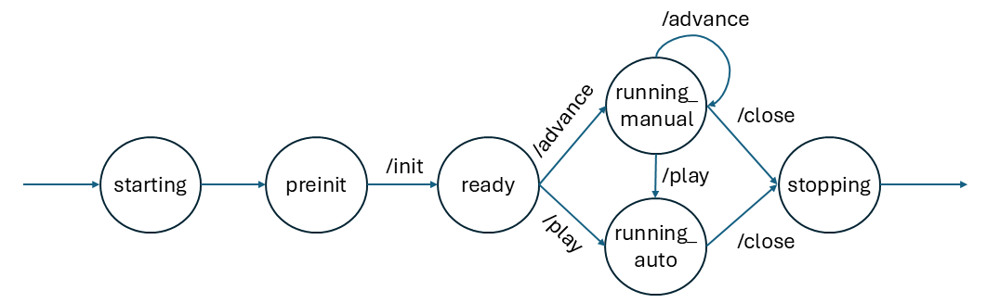

# Docker Protocol for Advancing Events

This document outlines the minimal REST api protocol, to be hosted in the Docker sentinal environment container, for advancing scheduled events.

# States/Statuses

The Docker sentinel environment can be in one of various states, as reported by the `/status` endpoint:

* `starting`: The environment is starting up but is not yet ready to initialize. (e.g., it could be opening files, setting up connections, etc.)

* `preinit`: The environment is ready to be initialized, but init has not yet been called. In this state, the environment can accept an `/init` call to schedule task-specific events and set task-specific parameters.

* `ready`: The environment has been initialized and is ready for either autoplay via the `/play` endpoint, or manual advancement via the `/advance` endpoint.

* `running_auto`: The environment is currently autoplaying events via the `/play` endpoint.

* `running_manual`: The environment is currently being advanced manually via the `/advance` endpoint.

* `stopping`: The environment has been closed and is in the process of stopping. There is no `stopped` state, as the environment will exit the Docker container upon stopping.


The following state transitions are allowed:




## Endpoints

### GET /status
Returns the status of the Docker sentinel environment. Results are returned in JSON format. The HTTP response codes will be 200 for success, 500 for server error, etc.

**Required state**: Any state
**Next state**: No change

#### Example Successful Response (200 OK):
```json
{ 
  "success": true,
  "status": "running",
  "simulation_time": 0,
  "next_event_time": 11
}
```

**NOTE:** Calling `/status` does not modify the state of the environment and can be use to learn the simulaiton time

#### Example Error Response (500 Internal Server Error):
```json
{ 
  "success": false,
  "message": "Internal server error"
}
```


### POST /init
Initializes the Docker sentinel environment with task-specific events (in addition to the default events). The request body should contain a JSON object with an array of events.

**Required state**: `preinit`
**Next state**: `ready`

Example Request Body:
```json
{
  "events": [
    {
      "time": 20,
      "type": "custom_event_type_1",
      "payload":  "... Arbitrary JSON data"
    },
    {
      "time": 25,
      "type": "custom_event_type_2",
      "payload":  "... Arbitrary JSON data"
    }
  ]
}
```

**NOTE 1**: The `/init` endpoint can only be called when the environment is in state `preinit`.
Calls outside this state will return an error.

**NOTE 2**: Times must are real-valued numbers representing the number of seconds from simulation start. Positive values are schedules in the future. Negative values are in the past.

**NOTE 3**: "... Arbitrary JSON data" indicates that any valid JSON data can be placed in the payload. It isn't necessarily a string, and should not be double-encoded.


Example Successful Response (200 OK):
```json
{ 
  "success": true,
  "simulation_time": 0,
  "next_event_time": 11
}
```

### GET /advance?t=\<SIMULATION\_TIME\>

Advances the simulation time to the specified time, processing all events scheduled up to, and including, that time. Conistent with all other time representations in the API, the `time` parameter is the number of seconds from simulation start.

**Required state**: `ready` or `running_manual`
**Next state**: `running_manual`

Example Request:
```
GET /advance?time=11
```

Example Successful Response (200 OK):
```json
{ 
  "success": true,
  "simulation_time": 11,
  "processed_events": [
    {
      "time": 8,
      "type": "default_event_type_1",
      "payload":  "... Arbitrary JSON data"
    },
    {
      "time": 10,
      "type": "custom_event_type_1",
      "payload":  "... Arbitrary JSON data"
    }
  ],
  "next_event_time": 14
}
```

**NOTE 1**: If there are no more scheduled events after processing, the `next_event_time` field will be `null`.
**NOTE 2**: If the specified `time` is earlier than the current simulation time, an error will be returned.


### GET /play

Starts automatic advancement of the simulation, processing events as their scheduled times are reached. The simulation will continue to advance indefinitely or until the `/close` endpoint is called.

**Required state**: `ready` or `running_manual`
**Next state**: `running_auto`

Example Successful Response (200 OK):
```json
{ 
  "success": true,
  "simulation_time": 11,
  "next_event_time": 14
}
```


### GET /close

Exits the current Docker container (assuming the simulation is running in Docker), by killing pid 1. When the Docker container exits, the test harness should immediately instantiate a new container to reset the simulation state.

**Required state**: Any state, but probably `running_auto`, or `running_manual`
**Next state**: N/A (container exits)

Example Successful Response (200 OK):
```json
{ 
  "success": true,
  "simulation_time": 11,
  "next_event_time": null
}
```


## Other Considerations

- All responses include `success`, `simulation_time`, and `next_event_time` fields.
- All timestamps are expressed as seconds from simulation start (i.e., the moment init() is called)
- The generic schema of an event is `{ "time": "<SIMULATION_TIME>", "type": "<EVENT_TYPE>", "payload": <ARBITRARY_JSON_DATA> }`
